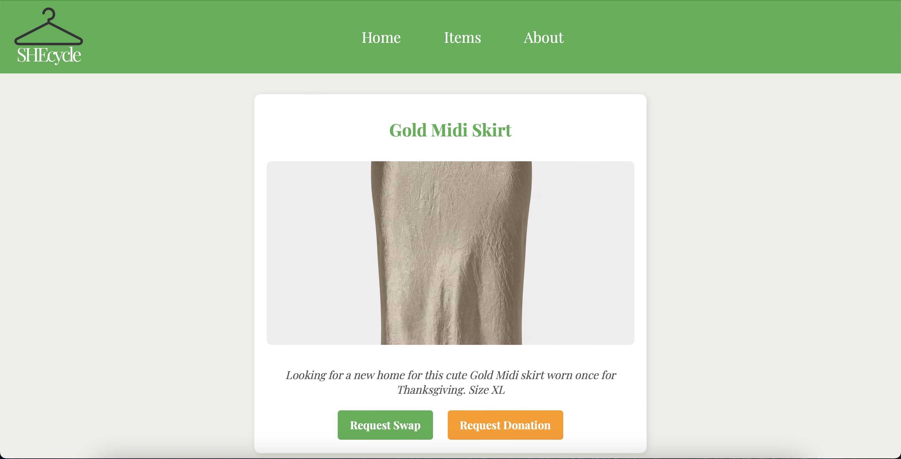

# SHEcycle

<p align="center">
  
</p>

## ♻️ About SHEcycle

SHEcycle is a sustainable fashion marketplace designed to help college women swap, donate, and earn credits for gently used clothing. By promoting clothing reuse and community-driven exchanges, SHEcycle reduces fashion waste, empowers women, and encourages sustainable fashion choices on college campuses.

With SHEcycle, users can:\
✔ Create an Account – Join a local network of students for fashion swaps.\
✔ Browse & List Items – Find second-hand clothing or list your own gently used pieces.\
✔ Swap or Donate – Trade clothing with others or donate items to earn credits.\
✔ Earn Credits – Donations and successful swaps reward users with credits to get new items.\
✔ Pick Up & Drop Off Locally – Exchanges happen on campus, reducing waste and shipping costs.

*Swap, Style, Sustain* – SHEcycle is changing the way fashion works on college campuses!

## 💜 Made for HackViolet 2025

**HackViolet** is an annual women's empowerment hackathon hosted at Virginia Tech. The event aims to increase gender diversity in tech, inspire creativity, and foster innovation in a supportive environment.

**Theme**: Empowering women through technology\
**Location**: Virginia Tech\
**Year**: 2025\
**Focus**: Building projects that focus on *Female-Empowerment*, *Social Good*, and *Sustainability*

SHEcycle was created during HackViolet 2025 to address fast fashion waste and sustainability while empowering college women to embrace circular fashion economies.

## 🛠 How to Use SHEcycle

### 1. Clone the Repository
```bash
git clone https://github.com/benjamin-ryan/HackViolet
cd SHEcycle
```

### 2. Install Dependencies

#### Backend (Express + MongoDB)
```bash
cd backend
npm install
```

#### Frontend (Angular)
```bash
cd frontend/shecycle-frontend
npm install
```

### 3. Set Up Environment Variables
Create a `.env` file in the `backend` folder and add the following:

```env
MONGO_URI=mongodb+srv://benjaminryan:<password>@cluster0.t5jp0.mongodb.net/shecycle?retryWrites=true&w=majority&appName=Cluster0
PORT=8080
```

### 4. Run the Application

#### Start Backend Server
```bash
cd backend
node server.js
```

#### Start Frontend
```bash
cd frontend/shecycle-frontend
ng serve
```

Now, open your browser and start using **SHEcycle**!

## 💻 Tech Stack

**Frontend**: Angular\
**Backend**: Node.js & Express.js\
**Database**: MongoDB (MongoDB Atlas)\
**Styling**: CSS Grid & Flexbox

## 🌱 Future Plans

**Full Deployment & Domain Registration** – Move from local testing to a fully hosted platform with a custom domain.\
**User Authentication & Profiles** – Allow users to create personal profiles with their closet, wishlist, and past swaps.\
**Campus-Specific Communities** – Expand beyond Virginia Tech to more college campuses, enabling location-based filtering.\
**Mobile Optimization & App Development** – Build a mobile-friendly version for easier access.\
**Partnerships with Sustainability Initiatives** – Collaborate with eco-friendly brands and student organizations.

## 🤝 Contributors

Designed & Developed by:

👨‍💻 Benjamin Ryan – Lead Programmer\
👩‍💻 Caroline Hamlet – Lead Designer\
👩‍💻 Hanna Van Roe – Lead Creative

## ✨ Showcase



